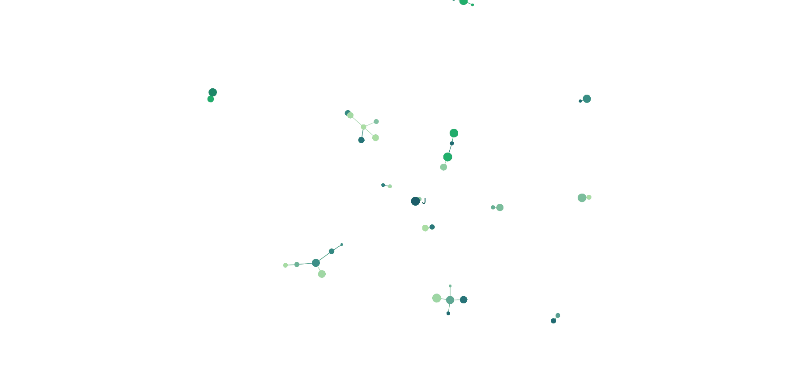

# sigmajs

[](https://travis-ci.org/JohnCoene/sigmajs) [](https://ci.appveyor.com/project/JohnCoene/sigmajs)



[sigmajs](http://sigmajs.org/) for R.

With the rise in popularity of networks, it is important for R users to have access to a package that allows visualising the aforementioned networks in a highly configurable, interactive and dynamic manner.
`sigmajs` is a [Shiny](https://shiny.rstudio.com/)-centric in order to best leverage the [original library](http://sigmajs.org/)'s great many methods.

All graphs must be initialised with the `sigmajs()` function, all the functions of the :package: start with `sg_` and its proxies end in `_p`, functions are pipe-friendly (`%>%`). All [events](https://github.com/jacomyal/sigma.js/wiki/Events-API) can be captured in Shiny.

# Install

```r
# install.packages("devtools")
devtools::install_github("JohnCoene/sigmajs")
```

# Examples

Most functions have corresponding `demo()`.

```r
library(sigmajs)

# generate data
nodes <- sg_make_nodes()
edges <- sg_make_edges(nodes)

# visualise
sigmajs() %>%
	sg_nodes(nodes, id, label, size, color) %>%
	sg_edges(edges, id, source, target)

# from igraph 
data("lesmis_igraph")
 
layout <- igraph::layout_with_fr(lesmis_igraph)

sigmajs() %>%
	sg_from_igraph(lesmis_igraph, layout)

# from GEXF
gexf <- system.file("examples/arctic.gexf", package = "sigmajs")

sigmajs() %>% 
	sg_from_gexf(gexf) 

# proxies demos
demo(package = "sigmajs")
```
